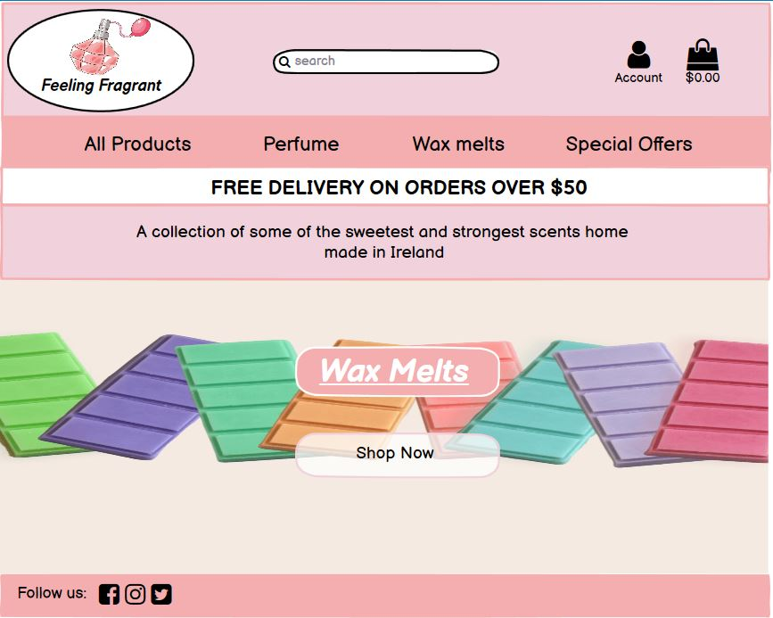
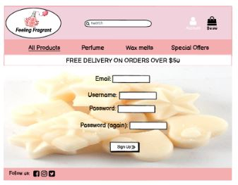
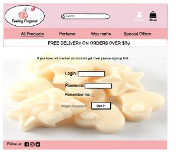
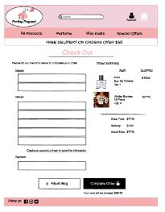
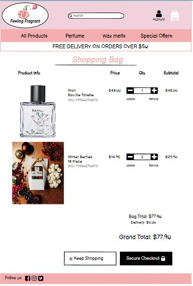
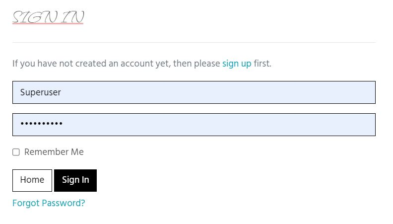
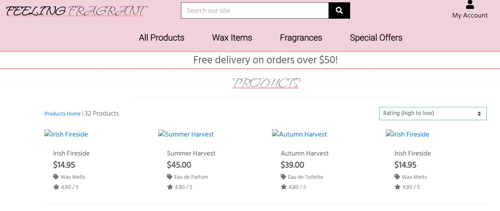
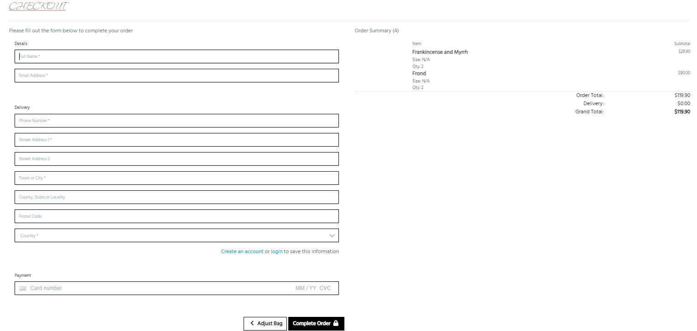

# Feeling Fragrant

Feeling fragrant is a site aimed to promote homemade frangrances created by people in Ireland

User Experience
======

### Target Audience
<ul> 
<li>People looking to purchase scented wax crafts such as wax melts or candles.</li>
<li>People looking to support Irish crafts</li>
</ul>

### User Requirements
<ul>
<li> Links and functions that work as expected</li>
<li> High quality product photos</li>
<li> Product details and descriptions</li>
<li> Bright, eye catching colours and presentation</li>
<li> Easy and clear to use navigation and accessibility</li>
<li> A trustworthy, risk free market place</li>
<li> A secure check out</li>
</ul>

### User Stories

#### First-time User 
<ul>
<li> I want to be able to register an account and track my purchases</li>
<li> I want to be able to browse a wide variety of organised products for sale</li>
<li> I want to be able to filter product ranges from low to high price etc</li>
<li> I want to be able to scroll through products and click and view products as I please</li>
<li> I want to be able to easily navigate the store and have options on which part of the store I want to browse</li>
</ul>

#### Returning User
<ul>
<li> I would like to be able to browse a wider variety of products</li>
<li> I would like to be able to sign up for a mailing list to receive updates about sales</li>
<li> I would like to be able rate the products after purchasing</li>
<li> I would like to be able to read other customers reviews of the store and products</li>
<li> I would like to be able to read more about the seller and see their details</li>
</ul>

Design
======

### Structure

The site is designed in a well structured way which makes navigation easy for the user
 

The site is bright and eye catching

 The colours of the website complement the theme of the store and help keep your attention

Upon clicking into the site the user is greeted with the homepage where they can get an immediate understanding of what the store is for and are presented with the option to shop now

### Color

For the colour scheme I went with colours I felt best complemented the theme of the store. These being bright pinks and purples

After deciding on my colour scheme I tested them on webaim to make sure the contrast between them was right

### Typography

The hind siliguri, waterfall and roboto fonts were used for the store

They are all elegant, pretty fonts that suit the feminine theme of the store
 

They are easy to read and look attractive

### Wireframes

Homepage

Product page

Sign In page

Sign Up page

Check out page

Shopping Bag

Features
======

### Navigation Bar
<ul>
<li>Featured on all Web pages</li>
<li>Utilises hyperlinks for users to easily navigate</li>
<li>Features click able links to easily find what you are looking for</li>
<li>Utilises a search bar so users can find what they are looking for easier</li>
</ul>

### Home Page
<ul>
<li>Displays the main focus of the store and offers users and easy way to start shopping</li>
<li>Gives users an impression of what to expect from the rest of the store</li>
<li>Allows users to register or log in</li>
<li>Allows users to view their basket</li>
</ul>

### Sign In/Out
<ul>
<li>Allows users to sign in/out of their account</li>
<li>Allows users to make secure purchases and view their purchase history</li>
</ul>

### Log In
<ul>
<li>Allows users to create a profile and sign in</li>
</ul>

### Product page
<ul>
<li>Allows users to view all products or to sort how they would like to see them eg. Price high to low</li>
</ul>

### Checkout
<ul>
<li>Allows users to checkout with the products they'd like to buy securely</li>
</ul>

### Future features to implement
<ul>
<li>Plans to create a Suggestions page so shoppers can recommend any products they like for the site</li>
</ul>

Technologies Used
======

### Languages

<ul>
<li>HTML</li>
<li>CSS</li>
<li>Javascript</li>
<li>Python</li>
</ul>

### Frameworks & Tools

<ul>
<li>Balsamiq</li>
<li>Git</li>
<li>GitHub</li>
<li>Gitpod</li>
<li>Google Fonts</li>
<li>Django</li>
<li>PostgreSQL</li>
<li>Bootstrap v5.0</li>
<li>Favicon.io</li>
<li>Hover.css:</li>
</ul>

Testing
======

## CSS

No errors were found when ran through the W3C CSS validator https://validator.w3.org/>

## HTML

Some errors were found when running through the W3C HTML validator https://validator.w3.org/ but nothing that would affect how the code works

## Python

Some errors were found when running through the PEP8 Python validator http://pep8online.com/ but they couldnt be fixed because splitting the line would have broken the code

## Javascript

Some minor errors were found while running through the JShint Javascript validator https://jshint.com/ but only those related to ES6

Bugs
======

When the app is deployed through heroku the admin sign in wont work but it does when deployed locally, I have not been able to find a fix for this

The Contact Us Page is incomplete

Stripe payments stopped working at an unknown point in development, after reviewing with my peers this seems to be a common issue after deployment to heroku.

Right before submiting I developed a bug where the admin credentials throw a server 500 error when trying to log in with the credentials on heroku 

Deployment
======

The website was deployed using Heroku using the following steps:

### Requirements and Procfile

Heroku needs to know which technologies are being used and any requirements, so I created files to let it know. Before creating the Heroku app, create these files using the following steps in GitPod:

<ul>
<li>In the GitPod terminal, type pip3 freeze --local > requirements.txt to create your requirements file.</li>
<li>Create your Procfile and insert the following code: web: gunicorn ARTstop.wsgi:application and make sure there is no additional blank line after it.</li>
<li>Push these files to your repository.</li>
</ul>

### Creating Heroku App

<ul>
<li>Log into Heroku</li>
<li>Select 'Create New App' from your dashboard</li>
<li>Choose an app name (if there has been an app made with that name, you will be informed and will need to choose an alternative)</li>
<li>Select the appropriate region based on your location</li>
<li>Click 'Create App'</li>
</ul>

### Connecting to GitHub

<ul>
<li>From the dashboard, click the 'Deploy' tab towards the top of the screen</li>
<li>From here, locate 'Deployment Method' and choose 'GitHub'</li>
<li>rom the search bar newly appeared, locate your repository by name</li>
<li>When you have located the correct repository, click 'Connect'</li>
<li>DO NOT CLICK 'ENABLE AUTOMATIC DEPLOYMENT': This can cause unexpected errors before configuration.</li>
</ul>

### Environment Variables

<ul>
<li>Click the 'Settings' tab towards the top of the page</li>
<li>Locate the 'Config Vars' and click 'Reveal Config Vars'</li>
<li>Add the necessary variables</li>
</ul>

### In Heroku.com:

<ul>
<li>From the dashboard, click the 'Deploy' tab towards the top of the screen</li>
<li>From here, locate 'Deployment Method' and choose 'GitHub'</li>
<li>From the search bar newly appeared, locate your repository by name</li>
<li>When you have located the correct repository, click 'Connect'</li>
<li>DO NOT CLICK 'ENABLE AUTOMATIC DEPLOYMENT': This can cause unexpected errors before configuration.</li>
<li>Underneath, locate 'Manual Deploy'; choose the main branch and click 'Deploy Branch'</li>
<li>Once the app is built (it may take a few minutes), click 'Open App' from the top of the page</li>
</ul>

Credits
======

### Tutorials Followed

Contact Us Page: https://www.youtube.com/watch?v=sGQSz22U8VM&ab_channel=EasyTutorials

Footer: https://codepen.io/scanfcode/pen/MEZPNd

### Content and Media

https://burrenperfumery.com/

https://www.thegoodgarden.ie/

https://www.thelittlewaxcompany.ie/

### Acknowledgements

While making this project, I heavily relied on the tutorials provided by Code Institute, specifically the Boutique Ado tutorial and many other tutorials found online